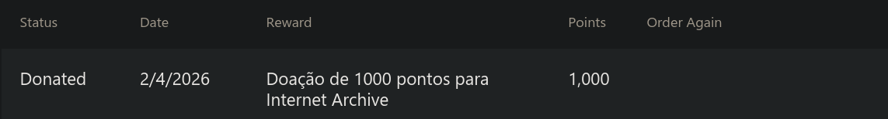

## You wouldn't download a car.

You also wouldn't download a stick of RAM. (Well, as of 2026, I'd actually say some people and enterprises would―if they could—, to be fair.)

But cut the jokes, I have some important points to make. And then the quotes above will probably make sense.

Since mid-2025, I've been staying at my grandma through the afternoon from Mondays to Fridays. It was also around this time that I was assessing work listings and was on the verge of sharing my resumé with available employers. Regarding her, some supervision has been needed in order to ensure she doesn't do unexpected (and potentially unsafe) things, as the age catches her. And oh boy, wasn't this such a curveball upon my expectations of cultivating and developing my own little space and goals...

Over time, I'll admit, I've gotten a bit concerned with the direction her attention level is going. Don't get me wrong though, her cognition is still there, however it's currently not quite as sharp as it used to be. Furthermore, we can't just throw her off into the nearest eldercare clinic and move forward with our days: her volition is sovereign and there are plenty of questionable caregivers out there, as well as the places themselves... 

This brings me to even more nowadays stuff.

You know, I'm a reluctant user of a few Microsoft services. I can't be proud of oftentimes being the most valuable product on the table, so I'm fond of taking the most out of their extraordinarily generous solutions and applications. Anyways, go back in time a couple years and you could find me almost always redeeming MS Rewards points in exchange for digital credits. 

Returning to the current showings, I find myself with points accumulating and the damn providers/vendors/storefronts with redeemable digital credits have been in a quest to restrict their aplicability like crazy. By means of some ponderation, backed by [people's point-to-currency estimations](https://www.reddit.com/r/MicrosoftRewards/comments/1iftmhx/how_much_is_a_point_worth_in_donations/), I am really willing to cast a recurring contribution of some sort, since that is also a feature on Microsoft's Rewards program and I've figured that's the best way of actually making it count towards a truly *rewarding* investment. (Of course, provided Microsoft *actually* plays the role they claim to.) 

Because after all, you probably wouldn't be able download a three-dimensional model of a car, your imaginary GF's hilarious edit on Uncyclopedia or the scam that was [soft-ram](https://archive.org/details/soft-ram) if it wasn't thanks to open source and/or NPO-based software.

># ***Pay it forward!*** 

### *[en-US]*

**Citizens worldwide**: either donate
1. directly to the organizations,
2. through [Microsoft Rewards](https://rewards.bing.com/redeem/donate), or
3. help me with my developer setup **and no undisclosed purposes or matters**: **I'm committed to ALWAYS send half of the donation value (before taxes and fees, including the processing-related ones) to an institution of your choice**, for which my personal suggestions would be, according to their impact on my habits and in no particular order:
* Internet Archive (web.archive.org maintainers)
* Wikimedia Foundation (including but not limited to Wikipedia developers)
* KDE (makers of the Plasma desktop environment).

I'll be honored to fulfill this commitment. For the time being, please go with option(s) 1 and/or 2 as I search for an efficient platform to handle international donations.

**Brazilian citizens**: all of the above, plus
*  donate using your preferred method [here](link.mercadopago.com.br/contribslorod). **Please tell me what institution you'd like me to send half of your donation to.**

#### Once the transfer is complete, ping me on Matrix or via email (links are in my profile) with your receipt attached and point me to the org I should share the donation with, preferably including their page on similarsites.com.

The similarsites.com lookup will show the authenticity of the web address you send me, which helps to prevent typosquatting, spoofing etc.
For example, you would send https://www.similarsites.com/site/loremipsum.io if you wanted Lorem Ipsum to receive a share.

### Thank you with the whole of my heart and have a nice day!
If you wish a permanent shoutout on my little site just mention when contacting me :)

### *[pt-BR]*
**Cidadãos brasileiros**: doe
1. diretamente para as organizações,
2. por meio de [Microsoft Rewards](https://rewards.bing.com/redeem/donate), ou
3. ajude-me com meu setup de desenvolvimento **e nenhuma outra finalidade oculta; zero letras miúdas**: **estou comprometido a SEMPRE enviar metade do valor da doação (antes de impostos e taxas, incluindo aqueles devidos ao processamento) a uma instituição de sua escolha**, para a qual tenho as seguintes sugestões *pessoais*, conforme impacto em meus hábitos cotidianos e sem nenhuma ordem de favorecimento:
* Internet Archive (mantenedores da ferramenta web.archive.org)
* Wikimedia Foundation (desenvolvedores do projeto Wikipédia)
* KDE (titulares do ambiente desktop Plasma).
> Doe com o meio desejado [aqui](link.mercadopago.com.br/contribslorod). **Favor mencionar a instituição para a qual você quer que eu envie metade do valor de sua doação.**

#### Uma vez que a transferência tenha sido concluída, me acione no Matrix ou via email (links em meu perfil aqui no GitHub) com seu comprovante anexado e dirija-me à organização 	que desejar, preferencialmente indicando sua página no similarsites.com, a fim de os donativos serem repassados corretamente. 

Isso é para evitar domínios fraudulentos e enganosos.
Por exemplo, enviaria https://www.similarsites.com/site/loremipsum.io se quisesse que Lorem Ipsum recebesse sua fatia.

### Meu muito obrigado pela sua contribuição e tenha um excelente resto de dia, semana ou mês!
Se quiser um "salve" permanente no meu site, diz na sua mensagem :)