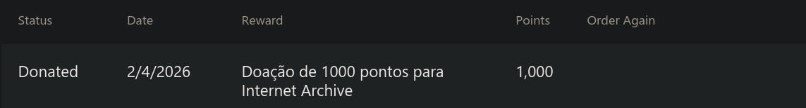

<h1>[EN-US] NO LONGER ACCEPTING DONATIONS. THE PAST INITIATIVE CAN BE FOUND BELOW. THANK YOU FOR YOUR UNDERSTANDING!</h1>
<h1>[PT-BR] DOAÇÕES DESCONTINUADAS. PARA FINS ESTRITAMENTE DE CONSULTA, A INICIATIVA ORIGINAL PERMANECE ABAIXO, NA ÍNTEGRA. AGRADEÇO A COMPREENSÃO!</h1>
<del>
<h2>You wouldn&#39;t download a car.</h2>

You also wouldn&#39;t download a stick of RAM. (Well, as of 2026, I&#39;d actually say some people and enterprises would―if they could—, to be fair.)
But cut the jokes, I have some important points to make. And then the quotes above will probably make sense.

Since mid-2025, I&#39;ve been staying at my grandma through the afternoon from Mondays to Fridays. It was also around this time that I was assessing work listings and was on the verge of sharing my resumé with available employers. Regarding her, some supervision has been needed in order to ensure she doesn&#39;t do unexpected (and potentially unsafe) things, as the age catches her. And oh boy, wasn&#39;t this such a curveball upon my expectations of cultivating and developing my own little space and goals...

Over time, I&#39;ll admit, I&#39;ve gotten a bit concerned with the direction her attention level is going. Don&#39;t get me wrong though, her cognition is still there, however it&#39;s currently not quite as sharp as it used to be. Furthermore, we can&#39;t just throw her off into the nearest eldercare clinic and move forward with our days: her volition is sovereign and there are plenty of questionable caregivers out there, as well as the places themselves... 

This brings me to even more nowadays stuff.

You know, I&#39;m a reluctant user of a few Microsoft services. I can&#39;t be proud of oftentimes being the most valuable product on the table, so I&#39;m fond of taking the most out of their extraordinarily generous solutions and applications. Anyways, go back in time a couple years and you could find me almost always redeeming MS Rewards points in exchange for digital credits. 

Returning to the current showings, I find myself with points accumulating and the damn providers/vendors/storefronts with redeemable digital credits have been in a quest to restrict their aplicability like crazy. By means of some ponderation, backed by <a href="https://www.reddit.com/r/MicrosoftRewards/comments/1iftmhx/how_much_is_a_point_worth_in_donations/">people&#39;s point-to-currency estimations</a>, I am really willing to cast a recurring contribution of some sort, since that is also a feature on Microsoft&#39;s Rewards program and I&#39;ve figured that&#39;s the best way of actually making it count towards a truly <em>rewarding</em> investment. (Of course, provided Microsoft <em>actually</em> plays the role they claim to.) 

Because after all, you probably wouldn&#39;t be able download a three-dimensional model of a car, your imaginary GF&#39;s hilarious edit on Uncyclopedia or the scam that was <a href="https://archive.org/details/soft-ram">soft-ram</a> if it wasn&#39;t thanks to open source and/or NPO-based software.

<blockquote>
<h1><em><strong>Pay it forward!</strong></em></h1>
</blockquote>
<h3><em>[en-US]</em></h3>

<strong>Citizens worldwide</strong>: either donate

<ol>
<li>directly to the organizations,</li>
<li>through <a href="https://rewards.bing.com/redeem/donate">Microsoft Rewards</a>, or</li>
<li>help me with my developer setup <strong>and no undisclosed purposes or matters</strong>: <strong>I&#39;m committed to ALWAYS send half of the donation value (before taxes and fees, including the processing-related ones) to an institution of your choice</strong>, for which my personal suggestions would be, according to their impact on my habits and in no particular order:</li>
</ol>
<ul>
<li>Internet Archive (web.archive.org maintainers)</li>
<li>Wikimedia Foundation (including but not limited to Wikipedia developers)</li>
<li>KDE (makers of the Plasma desktop environment).</li>
</ul>

I&#39;ll be honored to fulfill this commitment. You can send any amount to the Bitcoin address that is at <a href="https://www.blockchain.com/explorer/addresses/btc/bc1qufrmx28twr4mk3vcflnmc0tsy266vre0n88hgx">https://www.blockchain.com/explorer/addresses/btc/bc1qufrmx28twr4mk3vcflnmc0tsy266vre0n88hgx</a>. <a href="https://github.com/lorods/funding?tab=readme-ov-file#bitcoin-address-in-qr-code-format--endere%C3%A7o-btc-em-qr-code">QR code here</a>.  

<strong>Brazilian citizens</strong>: all of the above, plus:

<ul>
<li>donate using your preferred method <a href="https://livepix.gg/locontribs">here</a>. <strong>On the message body, please tell me what institution you&#39;d like me to send half of your donation to. livepix.gg is the intermediate that fulfills this transaction, so I cannot see any sender&#39;s personal information that could be tied to their Pix transfer(s) and would then be displayed to a regular recipient if the payment processor wasn&#39;t LivePix.</strong> <em>So far I couldn&#39;t find how to remove the minimum donation requirement, which defaulted to and is currently allowing only BRL 1 and higher.</em></li>
</ul>
<h4>Once the transfer is complete, ping me on Matrix or via email (UNLESS when donating through LivePix, which further simplifies delivering your preferences to me; otherwise, all means to contact me are in <a href="https://github.com/lorods#:~:text=lorods%2Dgh%20at%20outlook%20dot%20com">my profile</a>) with your receipt attached and point me to the org I should share the donation with, preferably including their page on similarsites.com.</h4>

The similarsites.com lookup will show the authenticity of the web address you send me, which helps to prevent typosquatting, spoofing etc.
For example, you would send <a href="https://www.similarsites.com/site/loremipsum.io">https://www.similarsites.com/site/loremipsum.io</a> if you wanted Lorem Ipsum to receive a share.

<h3>Thank you with the whole of my heart and have a nice day!</h3>

If you wish a permanent shoutout on <a href="https://t.ly/0I4uH">my little site</a> just mention when contacting me :)

<h3><em>[pt-BR]</em></h3>

<strong>Cidadãos brasileiros</strong>: doe

<ol>
<li>diretamente para as organizações,</li>
<li>por meio de <a href="https://rewards.bing.com/redeem/donate">Microsoft Rewards</a>, ou</li>
<li>ajude-me com meu setup de desenvolvimento <strong>e nenhuma outra finalidade oculta; zero letras miúdas</strong>: <strong>estou comprometido a SEMPRE enviar metade do valor da doação (antes de impostos e taxas, incluindo aqueles devidos ao processamento) a uma instituição de sua escolha</strong>, para a qual tenho as seguintes sugestões <em>pessoais</em>, conforme impacto em meus hábitos cotidianos e sem nenhuma ordem de favorecimento:</li>
</ol>
<ul>
<li>Internet Archive (mantenedores da ferramenta web.archive.org)</li>
<li>Wikimedia Foundation (desenvolvedores do projeto Wikipédia)</li>
<li>KDE (titulares do ambiente desktop Plasma).</li>
</ul>
<blockquote>

Doe qualquer valor com o meio desejado <a href="https://livepix.gg/locontribs">aqui (moeda local)</a>⁺ ou para <a href="https://www.blockchain.com/explorer/addresses/btc/bc1qufrmx28twr4mk3vcflnmc0tsy266vre0n88hgx">este endereço Bitcoin</a> — <a href="https://github.com/lorods/funding?tab=readme-ov-file#bitcoin-address-in-qr-code-format--endere%C3%A7o-btc-em-qr-code">QR code aqui</a>.

</blockquote>
<pre><code>- Até o momento não consegui remover o requisito de doação mínima, que foi automaticamente definido em R$ 1.
</code></pre>

<strong>Favor mencionar a instituição para a qual você quer que eu envie metade do valor de sua doação.</strong>

<h4>Uma vez que a transferência tenha sido concluída, me acione no Matrix ou via email (EXCETO ao doar com LivePix, que simplifica o processo da mensagem, bastando você escrevê-la no campo correspondente apresentado <a href="https://livepix.gg/locontribs">na página</a>) e prosseguir normalmente com o fluxo; demais links em <a href="https://github.com/lorods#:~:text=lorods%2Dgh%20at%20outlook%20dot%20com">meu perfil aqui no GitHub</a>) com seu comprovante anexado e dirija-me à organização que desejar, preferencialmente indicando sua página no similarsites.com, a fim de os donativos serem repassados corretamente.</h4>

Isso é para evitar domínios fraudulentos e enganosos.
Por exemplo, enviaria <a href="https://www.similarsites.com/site/loremipsum.io">https://www.similarsites.com/site/loremipsum.io</a> se quisesse que Lorem Ipsum recebesse sua fatia.

<h3>Meu muito obrigado pela sua contribuição e tenha um excelente resto de dia, semana ou mês!</h3>

Se quiser um &quot;salve&quot; permanente no <a href="https://t.ly/0I4uH">meu site</a>, diz na sua mensagem :)

<h4>Bitcoin address in QR code format / endereço BTC em QR code</h4>

Below is an image, so it&#39;s harder to be tampered with.

</del>
